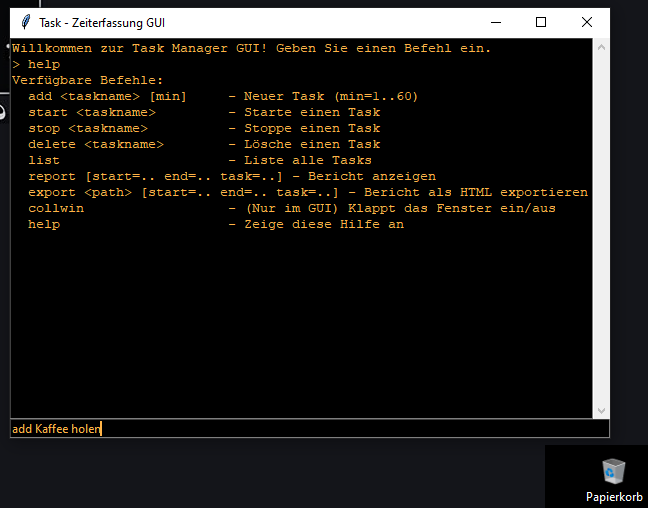
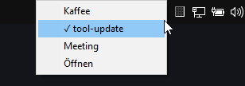

# Task- und Zeiterfassungstool

Ein vielseitiges Task- und Zeiterfassungstool mit CLI- und minimalistischer Nerd-GUI. Ideal für persönliche oder kleine Projekt-Workflows.

## Beschreibung

Ein flexibles Tool für Aufgaben- und Zeiterfassung mit benutzerfreundlicher CLI und nerdiger GUI.

### Funktionen

#### CLI-Kommandos
- `add <taskname> [minuten]`: Neuen Task hinzufügen mit optionaler Mindestdauer pro Session.
- `start <taskname>`: Startet einen Task.
- `stop <taskname>`: Stoppt einen Task und speichert die Dauer der Session.
- `delete <taskname>`: Löscht einen Task nach Bestätigung.
- `list`: Zeigt eine Übersicht aller Tasks und deren Status.
- `report [start=<YYYY-MM-DD> end=<YYYY-MM-DD> task=<taskname>]`: Generiert einen Bericht über Tasks und Sessions (optional mit Filtern).
- `export <output_path> [start=<YYYY-MM-DD> end=<YYYY-MM-DD> task=<taskname>]`: Exportiert einen HTML-Bericht (optional mit Filtern).
- `collwin`: Klappt das Ausgabefeld in der GUI ein oder aus.
- `help`: Zeigt eine Liste aller verfügbaren Befehle.

#### GUI-Eigenschaften
- **Tray-Icon:** Minimierung der GUI in die System-Tray mit Optionen, um Tasks direkt zu starten/stoppen.
- **GUI starten:** `python3 main.py gui`
- **Design:** Schwarzer Hintergrund mit VGA-Orange (#ffb347) als Textfarbe.
- **Minimierung:** Minimiert Fenster in die System-Tray statt es zu schließen.
- **Plattformunterstützung:**
  - **Linux:**  ggf. Installation von `libappindicator3-1` erforderlich (z. B. über `sudo apt install libappindicator3-1`).
  - **Windows:** Funktioniert mit den Standard-Desktop-Umgebungen.
- **Eingeklappte Größe (`collwin`)**:
  - Breite: 600 Pixel
  - Höhe: 25 Pixel
- **Normale Größe:**
  - Breite: 600 Pixel
  - Höhe: 400 Pixel


**Screenshot:**

GUI:



Tray:



#### Datenbank
- SQLite-basierte Speicherung (`tasks.db`).
- **Automatische Erstellung:** Die Datenbank wird automatisch erstellt, falls sie nicht existiert.
- Tabellenstruktur:
  - `tasks(id, name, is_running, current_start, minimum_minutes)`
  - `sessions(id, task_id, start, end, duration_sec)`

#### Berichte
- **HTML-Berichte:** Mit Bootstrap-stilisierten Tabellen für bessere Lesbarkeit.
- **Dynamische Pfade:** Automatische Generierung von Berichtsdateien mit Zeitstempel.

## Installation

### Voraussetzungen
- **Python 3.7 oder neuer** (inklusive Standardmodule: `sqlite3`, `tkinter`, `datetime`)
- Zusätzliche Python-Pakete:
  - `jinja2`: Für HTML-Template-Rendering
  - `pystray`: Für das Tray-Icon der GUI
  - `Pillow`: Für die Generierung des Tray-Icons

### Installation der Abhängigkeiten
#### Linux:
```bash
sudo apt update && sudo apt install python3 python3-pip python3-tk
pip3 install jinja2 pystray Pillow
```

#### Windows:
1. Installiere Python:
   - [Python herunterladen und installieren](https://www.python.org/downloads/)
   - Während der Installation die Option „Add Python to PATH“ aktivieren.
2. Installiere die Abhängigkeiten:
   ```cmd
   pip install jinja2 pystray Pillow
   ```

### Überprüfung der Installation
- **Prüfen, ob `tkinter` installiert ist:**
  ```bash
  python3 -m tkinter
  ```
  Wenn sich ein kleines Fenster öffnet, ist `tkinter` korrekt installiert.

### Installation des Tools
1. Repository klonen:
   ```bash
   git clone https://github.com/robatsh/Task-und-Zeiterfassungstool.git
   ```
2. Navigiere ins Projektverzeichnis:
   ```bash
   cd task-manager-tool
   ```
3. Starte das Programm:
   ```bash
   python3 main.py
   ```

## Verwendung

### CLI-Kommandos

Beispiele:
```bash
python3 main.py add "Task 1" 15
python3 main.py start "Task 1"
python3 main.py stop "Task 1"
python3 main.py report start=2025-01-01 end=2025-01-15 task=Task1
python3 main.py export ./report.html start=2025-01-01 end=2025-01-15
```

### GUI starten
```bash
python3 main.py gui
```

## Lizenz

Dieses Projekt steht unter der **GNU General Public License v3.0 (GPL-3.0)**. 

Details zur Lizenz findest du in der Datei `LICENSE`.

## Warnung

Dieses Projekt befindet sich noch in der Entwicklung. Der Einsatz erfolgt auf eigene Gefahr. Für Fehler oder Datenverlust wird keine Haftung übernommen.

## GitHub Setup

### Repository erstellen und initialisieren
1. **Erstelle ein neues Repository** auf GitHub mit dem Namen `task-manager-tool`.

2. **Lokales Repository initialisieren:**
   ```bash
   git init
   git add .
   git commit -m "Initial Commit: Task Manager Tool mit CLI- und GUI-Funktionalität"
   git branch -M main
   git remote add origin https://github.com/username/task-manager-tool.git
   git push -u origin main
   ```

### Weiterentwicklung
- Erstelle Pull Requests für Änderungen.
- Dokumentiere größere Änderungen im `CHANGELOG.md`.

---
